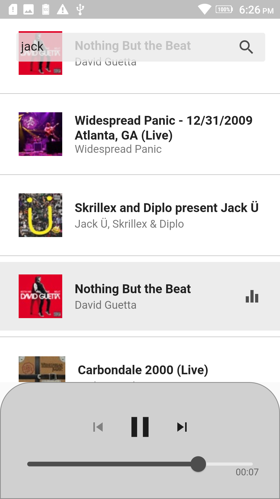

# walkman_music

A simple music player application built with Dart and Flutter

## Getting Started

This application tested in Android (physical device and emulator).



follow the instructions from the
Flutter site [here](https://flutter.dev/docs/get-started/install).

To build from source fetch the latest from master:

```
git clone https://github.com/rizwika94/MusicPlayer.git
```

From the anytime directory fetch the dependencies:

```
flutter packages get
```

Then either run:

```
flutter run
```

Or build:

```
flutter build apk
```

## App Architecture (Clean Architecture with Bloc Pattern)

It is based on a layered approach:

* UI - UI is presented to the user 
* Bloc - Handles the state for the UI. Communication happens through sinks and streams
* Data 
     * Network - Interacts with the iTunes API to fetch and parse data
     * Repository - The repository interfaces use the entities
         

## Plugins used in Project

Below are the packages used in the application

* [just_audio](https://pub.dev/packages/just_audio) -  Plays audio from URLs, files, assets, sDASH/HLS streams and playlist. 
* [audio session](pub.dev/packages/audio_session) - Configures your app's audio category and configures how your app interacts with other audio apps.
* [RxDart](https://pub.dev/packages/rxdart) - Adds the additional capabilities to Dart Streams and StreamControllers
* [Connectivity](https://pub.dev/packages/connectivity) - To discover network connectivity and configure themselves
